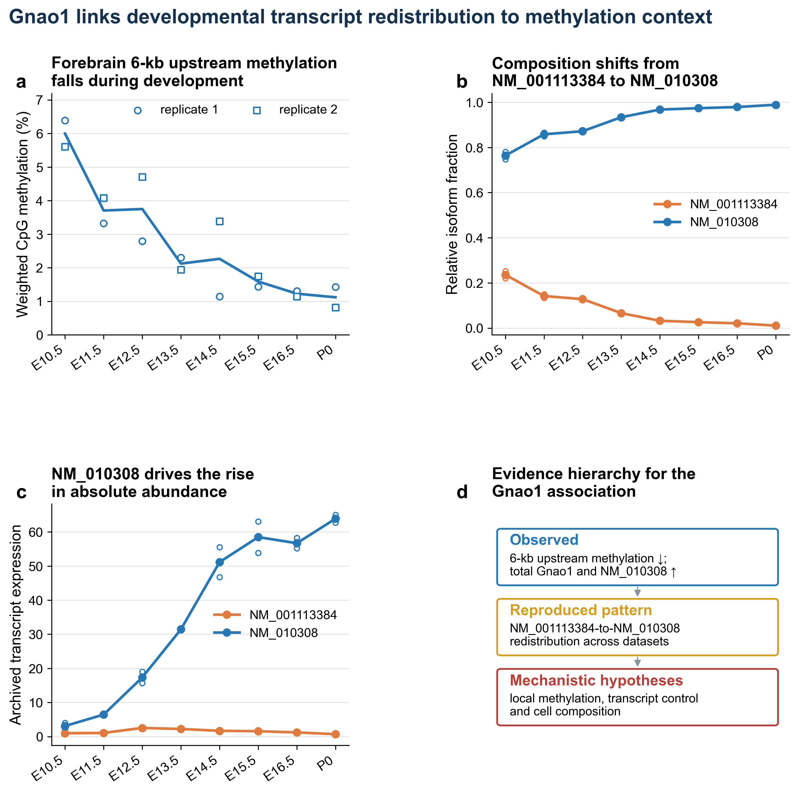

# transientDTU

> From stage-wise differential transcript-usage evidence to bounded,
> auditable diverge-reconverge episodes.

`transientDTU` is a post-inference framework for ordered, multi-group studies.
Upstream tools estimate differential transcript usage (DTU); `transientDTU`
asks a different temporal question: did one group separate coherently from the
required alternatives, remain separated for a bounded interval, and then
reconverge on both sides?

[Quick start](#quick-start) · [Input contract](#input-contract) ·
[Statistical scope](#statistical-scope) · [Documentation](#documentation)

<p align="center">
  
</p>

<p align="center"><em>A companion-study application linking developmental transcript redistribution to methylation context.</em></p>

## At a glance

| | |
|---|---|
| **Input** | Directed stage-specific effects and adjusted p-values, plus optional replicate-level usage |
| **Bioconductor interface** | `SummarizedExperiment`, `S4Vectors::DataFrame`, and a validated S4 result object |
| **Output** | Explicit episode intervals, diagnostics, reciprocal-exchange annotations, and deterministic gene rankings |
| **Best suited to** | Ordered developmental, longitudinal, perturbation, or lineage designs with observed flanks |
| **Not an upstream model** | Use satuRn, DEXSeq, DRIMSeq, limma, or another suitable method to estimate DTU evidence first |


The decision rule is explicit about component significance, effect size,
comparator coherence, episode duration, flanking reconvergence, missing data,
and replicate robustness. Every retained candidate can therefore be traced
back to the evidence and thresholds that produced it.

## Why use it?

Ordinary pairwise DTU tables answer whether usage differs in individual
contrasts. They do not themselves define a bounded temporal event. In
particular, they leave unanswered:

- which comparator groups must agree;
- how consecutive significant stages become one episode;
- what counts as reconvergence on either side;
- how boundaries and missing stages are handled;
- whether replicate distributions remain separated; and
- how candidates are ranked reproducibly.

`transientDTU` formalizes those choices in one reusable workflow. It supports
two or more groups, arbitrary ordered stages, irregular-time annotations,
multi-stage episodes and flanks, complete/quantile/median replicate summaries,
joint threshold sensitivity analysis, and known-truth simulation.

## Installation

After acceptance into Bioconductor, install the release with:

```r
if (!requireNamespace("BiocManager", quietly = TRUE))
    install.packages("BiocManager")

BiocManager::install("transientDTU")
```

During review, clone the package-only default branch and install it from a
current Bioconductor devel environment:

```sh
git clone https://github.com/Kohze/transientDTU.git
R CMD INSTALL transientDTU
```

## Quick start

The bundled example uses standard Bioconductor containers and seeded synthetic
data, so the workflow runs offline and has known truth.

```r
library(transientDTU)

data("transientExampleSE")
data("transientExamplePairwise")
stage_order <- S4Vectors::metadata(transientExampleSE)$stage_order

audit <- auditTransientInput(
    transientExamplePairwise,
    stage_order,
    usage = transientExampleSE
)

result <- runTransientDTU(
    transientExamplePairwise,
    stage_order = stage_order,
    usage = transientExampleSE,
    gene_name_col = "gene_name",
    gene_q_col = "gene_q",
    gene_q_threshold = 0.05,
    panel_size = 6
)

result
candidateTable(result)[, c(
    "rank", "gene_name", "focal_group", "start_stage", "end_stage",
    "n_features"
)]
```

The example returns four feature-level episodes grouped into two ranked gene
candidates. The result retains the standardized stage table, episode table,
candidate table, diagnostics, full decision parameters, and matched call.

```r
stageTable(result)
episodeTable(result)
candidateTable(result)
diagnosticTable(result)
decisionParameters(result)
```

## Input contract

Each atomic row represents one feature, gene, focal group, comparator group,
and stage:

| Meaning | Default column | Key requirement |
|---|---|---|
| Feature | `feature_id` | Maps to one gene |
| Gene | `gene_id` | Stable across stages |
| Focal group | `focal_group` | The group whose trajectory is being tested |
| Comparator | `comparator_group` | Different from the focal group |
| Stage | `stage` | Included in the declared `stage_order` |
| Signed effect | `effect` | Focal usage minus comparator usage |
| Adjusted p-value | `q_value` | Adjusted over the complete searched family |

Column names are configurable. Run `auditTransientInput()` before discovery to
identify duplicate contrasts, feature-to-gene conflicts, incomplete directed
families, missing stages, and under-replicated group-stage cells.

Two-group studies use `min_comparators = 1`; the paper-compatible multi-group
default requires two comparators. Targeted analyses may declare only the focal
groups that were prespecified for scanning.

## Relationship to existing methods

The framework complements, rather than replaces, Bioconductor inference tools:

| Method | Primary role | Relationship to `transientDTU` |
|---|---|---|
| satuRn, DEXSeq, DRIMSeq, limma | Estimate differential-usage effects and evidence | Supply the directed pairwise input after appropriate model fitting and reshaping |
| stageR | Stage-wise screening and confirmation with gene-level FDR control | Addresses multiplicity for predefined hypotheses, not bounded temporal intervals |
| `transientDTU` | Define and rank bounded diverge-reconverge episodes | Operates after inference and does not claim episode-level FDR control |

The upstream model should match the counts, replication, covariates, and study
design. `fitPairwiseUsage()` is included as a convenience adapter for processed
usage proportions; it is not a replacement for count-aware inference when
transcript counts are available.

## Statistical scope

An episode is a candidate satisfying a declared decision rule, not an
independently validated developmental switch. Adjusted component p-values do
not confer episode-level false-discovery-rate control after temporal selection.
Bulk composition, transcript identifiability, repeated measures, technical
batches, and external biological validation remain properties of the study,
not problems this package can silently repair.

The default `flank_missing = "available"` reproduces the motivating paper rule
and records flank completeness. Use `flank_missing = "complete"` when every
requested flank summary must be finite. Monotonic divergence and events
touching the first or last observed stage are deliberately outside the bounded
episode definition.

## Documentation

- [Workflow vignette](vignettes/transientDTU.Rmd): complete analysis, controls,
  plots, two-group designs, and interpretation.
- [Validation vignette](vignettes/validation.Rmd): known-truth benchmarking and
  joint threshold sensitivity.
- [Upstream input guide](inst/UPSTREAM_INPUT.md): input contract and guidance
  for common DTU methods.
- [Formal decision rule](inst/ALGORITHM.md): exact stage, episode, replicate,
  reciprocal, and ranking definitions.
- [Twenty-researcher use-case audit](USE_CASE_ANALYSIS.md): supported,
  conditional, and inappropriate applications.

## Development status

Version 0.99.1 is the initial Bioconductor submission candidate. The package
contains runnable examples, two executable vignettes, seeded Bioconductor-style
example data, unit tests, an optional full-paper regression test, formal
algorithm documentation, and AI-assistance provenance.

## Companion article

`transientDTU` is the reusable implementation accompanying *A systematic
framework for detecting transient developmental transcript-usage patterns
identifies an E15.5-centred midbrain candidate landscape* by Robin Gounder and
Russell Hamilton. The manuscript and reproducibility materials are maintained
at <https://github.com/kohze/developmental-dtu-patterns>.

The installed script `scripts/validate-paper-regression.R` reproduced all
1,348 archived episode rows and the exact ordered six-gene panel from the
manuscript. This regression establishes software equivalence to the paper's
decision layer; it is not independent biological validation. The article DOI
will be added here and to the package citation metadata when assigned.

## Support and contributing

Please use synthetic or de-identified data in reproducible reports. See
[SUPPORT.md](SUPPORT.md), [CONTRIBUTING.md](CONTRIBUTING.md), and the
[Code of Conduct](CODE_OF_CONDUCT.md) before opening an issue or pull request.
Security-sensitive reports should follow [SECURITY.md](SECURITY.md).

## Citation and licence

Use `citation("transientDTU")` for the current software citation. If the
package supports published work, please also cite the companion article once
its DOI is available; that article citation will be added here and to the
package metadata when assigned.

`transientDTU` is distributed under the Artistic License 2.0.
